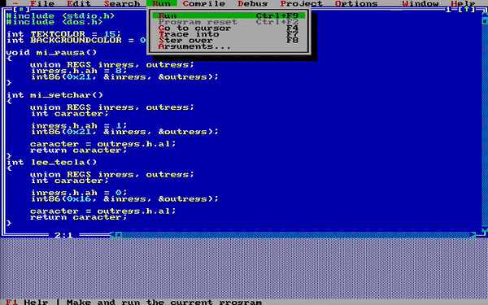
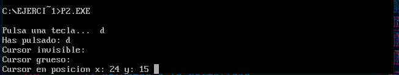
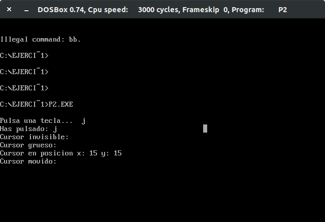
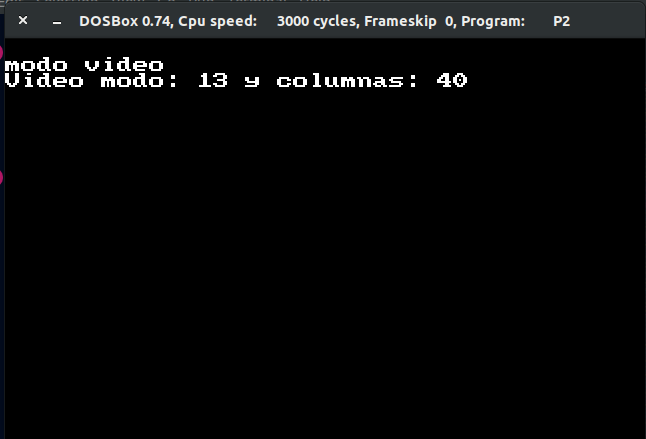
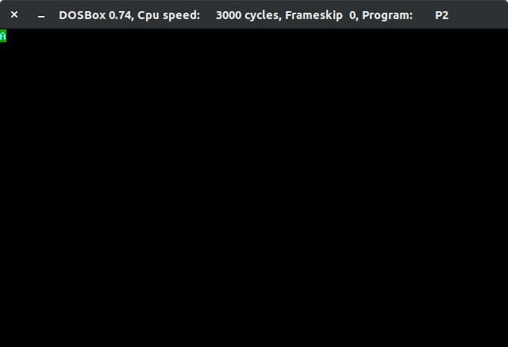

# Práctica 2
# Entrada/Salida utilizando interrupciones con lenguaje C

He hecho las siguientes funciones:

* lee_tecla(): lee una tecla pero sin mostrar
* cursorinicial(int *mix, int *miy): para saber la posición inicial del cursor (y así poder restaurarla).
* gotoxy(int mix, int miy): coloca el cursor en una posición determinada
* setcursortype(int tipo_cursor): fijar el aspecto del cursor, debe admitir tres valores: INVISIBLE, NORMAL y GRUESO.
* setvideomode(int modo): fija el modo de video deseado
* getvideomode(int *mi_modo, int *n_columnas): obtiene el modo de video actual
* textcolor(int c): modifica el color de primer plano con que se mostrarán los caracteres
* textbackground(int c): modifica el color de fondo con que se mostrarán los caracteres
* clrscr(): borra toda la pantalla
* cputchar(char michar): escribe un carácter en pantalla con el color indicado actualmente
* getche(): obtiene un carácter de teclado y lo muestra en pantalla (llama a leetecla()).

## Ejecución

A continuación se muestra un gif (un poco rápido) de la ejecución del programa. También añado algunas capturas de lo más relevante.

La secuencia que se aprecia es: lectura de teclado, impresión, cursores, posición actual del cursor, posición del cursor movida (en modo cursor grueso), modo video, lectura de parámetros en modo video, (cambio de colores de texto), impresión de "A" con colores cambiados, se espera a introducir una tecla y se imprime con esos colores, limpieza de pantalla.

Aquí se ve la posición del cursor inicial:

Aquí cómo ha cambiado su posición en la pantalla:

Ahora estamos en modo gráfico:

Se muestra letra con color de fondo y de texto cambiado:
