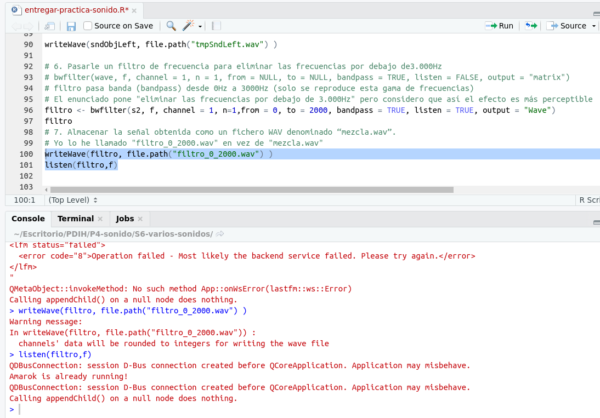

# Práctica 4. Sonido en R

<!-- vscode-markdown-toc -->
* 1. [Antes de empezar...](#Antesdeempezar...)
* 2. [Intrucciones para el primer inicio](#Intruccionesparaelprimerinicio)
* 3. [Intrucciones para inicios sucesivos](#Intruccionesparainiciossucesivos)
* 4. [ Ejercicios](#Ejercicios)
	* 4.1. [Leer dos ficheros de sonido (WAV o MP3) de unos pocos segundos de duración cada uno 🎶.](#LeerdosficherosdesonidoWAVoMP3deunospocossegundosdeduracioncadauno.)
	* 4.2. [Dibujar la forma de onda de ambos sonidos 🔊.](#Dibujarlaformadeondadeambossonidos.)
	* 4.3. [Obtener la información de las cabeceras de ambos sonidos ℹ️.](#Obtenerlainformaciondelascabecerasdeambossonidos.)
	* 4.4. [Unir ambos sonidos en uno nuevo. Dibujar la forma de onda de la señal resultante 🆕.](#Unirambossonidosenunonuevo.Dibujarlaformadeondadelasenalresultante.)
	* 4.5. [Pasarle un filtro de frecuencia para eliminar las frecuencias por debajo de 3.000Hz. Almacenar la señal obtenida como un fichero WAV denominado “mezcla.wav” 🎛️.](#Pasarleunfiltrodefrecuenciaparaeliminarlasfrecuenciaspordebajode3.000Hz.AlmacenarlasenalobtenidacomounficheroWAVdenominadomezcla.wav.)
	* 4.6. [Cargar un nuevo archivo de sonido, aplicarle eco y a continuación darle la vuelta al sonido. Almacenar la señal obtenida como un fichero WAV denominado “alreves.wav” 🔁.](#Cargarunnuevoarchivodesonidoaplicarleecoyacontinuaciondarlelavueltaalsonido.AlmacenarlasenalobtenidacomounficheroWAVdenominadoalreves.wav.)

<!-- vscode-markdown-toc-config
	numbering=true
	autoSave=true
	/vscode-markdown-toc-config -->
<!-- /vscode-markdown-toc -->

##  1. <a name='Antesdeempezar...'></a>Antes de empezar... 
Todos los scripts, sonidos e imágenes generadas están en este repositorio de GitHub: [https://github.com/Jesus-Sheriff/PDIH/tree/master/P4](https://github.com/Jesus-Sheriff/PDIH/tree/master/P4)

##  2. <a name='Intruccionesparaelprimerinicio'></a>Intrucciones para el primer inicio 

Primero hay que instalar RStudio. Una vez instalado, abrimos el archivo ```entregar-practica-sonido.R``` (es una especie de script).

Se nos mostrará algo así:


De izquierda arriba a derecha abajo vemos:

- Pantalla de "script".
- Variables declaradas.
- Terminal de R.
- navegador de archivos.

Instalamos los paquetes que vamos a necesitar:

- ```install.packages('tuneR', dep=TRUE)```
- ```install.packages('seewave', dep=TRUE)```

Seleccionamos con el ratón las instrucciones y damos en ```Run```.

Tenemos que tener en el sistema un reproductor de audio (he usado ```Amarok```) que se establece con la orden ```setWavPlayer('amarok')```

También hay que establecer el working directory:

- Con la orden ``` setwd("~/Escritorio/PDIH/P4-sonido/S6-varios-sonidos")```
- Usando el navegador de archivos, navegando hasta la carpeta donde tenemos los archivos y pulsando en ```More > Set as working directory```

Ya tenemos el kiosco bien montado y todo lo que hagamos a continuación debe de funcionar.

La situación actual (variables guardadas, terminal...) puede guardarse para la próxima vez con ```Session > Save workspace as...```

##  3. <a name='Intruccionesparainiciossucesivos'></a>Intrucciones para inicios sucesivos

Si tenemos el script ```.R``` y un workspace guardado, abrimos los dos pinchando primero en uno y luego en otro.

Aún así, vamos a tener que ejecutar la carga de bibliotecas y los set cada vez que iniciemos el programa RStudio:

```
library(tuneR)
library(seewave)
setwd("~/Escritorio/PDIH/P4-sonido/S6-varios-sonidos")
setWavPlayer('amarok')
```


##  4. <a name='Ejercicios'></a> Ejercicios

###  4.1. <a name='LeerdosficherosdesonidoWAVoMP3deunospocossegundosdeduracioncadauno.'></a>Leer dos ficheros de sonido (WAV o MP3) de unos pocos segundos de duración cada uno 🎶. 


###  4.2. <a name='Dibujarlaformadeondadeambossonidos.'></a>Dibujar la forma de onda de ambos sonidos 🔊.

Plot del perro:


Plot del gato:


###  4.3. <a name='Obtenerlainformaciondelascabecerasdeambossonidos.'></a>Obtener la información de las cabeceras de ambos sonidos ℹ️.

VEmos los detalles de los audios. En este caso por ejemplo vemos que el sonido de la oveja es mono y del gato es estéreo. Uno está sampleado a 8000Hz y otro a 44100Hz (sampling estándar de CD).


###  4.4. <a name='Unirambossonidosenunonuevo.Dibujarlaformadeondadelasenalresultante.'></a>Unir ambos sonidos en uno nuevo. Dibujar la forma de onda de la señal resultante 🆕.

Aquí vemos las órdenes y el plot de la unión de ambos sonidos.


###  4.5. <a name='Pasarleunfiltrodefrecuenciaparaeliminarlasfrecuenciaspordebajode3.000Hz.AlmacenarlasenalobtenidacomounficheroWAVdenominadomezcla.wav.'></a>Pasarle un filtro de frecuencia para eliminar las frecuencias por debajo de 3.000Hz. Almacenar la señal obtenida como un fichero WAV denominado “mezcla.wav” 🎛️.

Aquí vemos cómo se aplica un filtro.

	Ojo! 👀

	Se ven warnings e información de debug procedente del reproductor.



###  4.6. <a name='Cargarunnuevoarchivodesonidoaplicarleecoyacontinuaciondarlelavueltaalsonido.AlmacenarlasenalobtenidacomounficheroWAVdenominadoalreves.wav.'></a>Cargar un nuevo archivo de sonido, aplicarle eco y a continuación darle la vuelta al sonido. Almacenar la señal obtenida como un fichero WAV denominado “alreves.wav” 🔁.

Al sonido anterior `filtro` le he aplicado eco. En mi caso he creado unos vectores de datos llamados `amp` y `delay` que son respectivamente los valores de las amplitudes y de los retrasos de las ondas de eco que vamos a añadir a nuestro sonido.


