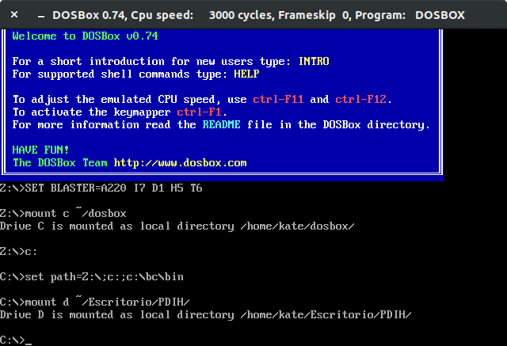
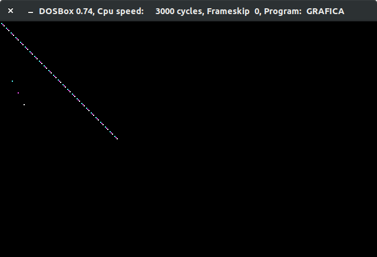
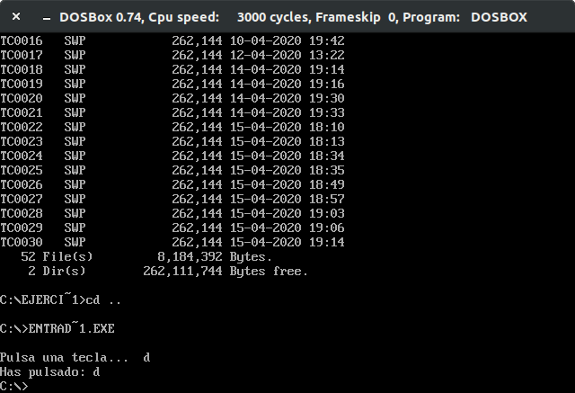

# Seminario 2.  Acceso a dispositivos de E/S en C

<!-- vscode-markdown-toc -->
* 1. [Configurar el inicio de DOSBox para que monte en la unidad C: el directorio donde se encuentra el entorno de programación Borland C. Añadir a la variable “PATH” de inicio el directorio “bin” donde se encuentra el ejecutable BC.EXE](#configurar-el-inicio-de-dosbox-para-que-monte-en-la-unidad-c:-el-directorio-donde-se-encuentra-el-entorno-de-programación-borland-c.-añadir-a-la-variable-“path”-de-inicio-el-directorio-“bin”-donde-se-encuentra-el-ejecutable-bc.exe)

   * 1.1. [Analizando línea a línea](#analizando-línea-a-línea)
* 2. [Realizar un programa en lenguaje C que llame a la función de cambio de modo de vídeo y comprobar su funcionamiento.](#realizar-un-programa-en-lenguaje-c-que-llame-a-la-función-de-cambio-de-modo-de-vídeo-y-comprobar-su-funcionamiento.)
* 3. [Realizar un programa en lenguaje C que llame a la función de interrupción correspondiente a la lectura de caracteres desde teclado. Ejecutarlo para leer pulsaciones de teclas y mostrarlas por pantalla usando otra función de interrupción.](#realizar-un-programa-en-lenguaje-c-que-llame-a-la-función-de-interrupción-correspondiente-a-la-lectura-de-caracteres-desde-teclado.-ejecutarlo-para-leer-pulsaciones-de-teclas-y-mostrarlas-por-pantalla-usando-otra-función-de-interrupción.)

<!-- vscode-markdown-toc-config
	numbering=true
	autoSave=true
	/vscode-markdown-toc-config -->
<!-- /vscode-markdown-toc -->


##  1. <a name='configurar-el-inicio-de-dosbox-para-que-monte-en-la-unidad-c:-el-directorio-donde-se-encuentra-el-entorno-de-programación-borland-c.-añadir-a-la-variable-“path”-de-inicio-el-directorio-“bin”-donde-se-encuentra-el-ejecutable-bc.exe'></a>Configurar el inicio de DOSBox para que monte en la unidad C: el directorio donde se encuentra el entorno de programación Borland C. Añadir a la variable “PATH” de inicio el directorio “bin” donde se encuentra el ejecutable BC.EXE

----------

Hay que modificar el archivo con configuración de DOSBox ubicado en ```~/.dosbox/dosbox-0.74.conf```. Hay que tener en cuenta que la carpeta dosbox está oculta y que el número que aparece (0.74) depende de la versión instalada.

Al final del documento aparecen las siguientes lineas que es donde se añaden nuestros comandos bash.

```bash

[autoexec]
# Lines in this section will be run at startup.
# You can put your MOUNT lines here.

mount c ~/dosbox
c:
set path=%path%;c:;C:\BC\BIN

mount d ~/Escritorio/PDIH/
```

En estas líneas hago cosas extra que no se piden en este ejercicio.

###  1.1. <a name='analizando-línea-a-línea'></a>Analizando línea a línea

`mount c ~/dosbox`

 Monta en C: (raiz) la carpeta `dosbox` que contiene ejercicios (no confundir `.dosbox` de `dosbox`).

`c:`

Establece C: como directorio actual.

`set path=%path%;c:;C:\BC\BIN`

Establece el path con el directorio c:\bc\bin y con el directorio c: (esto último fue para unas pruebas personales). He detectado algo y es que la llamada al IDE Borland C (ejecutando `BC`) solo funciona desde la raiz, es decir, estando ubicado en `C:`. 

En cambio, un script llamado `ls.bat` ubicado en `C:` para ejecutar `dir` al escribir `ls` (típico de Linux) sí funciona en cualquier ubicación.

`mount d ~/Escritorio/PDIH/`

Otra decisión personal. He montado en otra partición (D:) otra carpeta local donde tengo todo lo de PDIH.



##  2. <a name='realizar-un-programa-en-lenguaje-c-que-llame-a-la-función-de-cambio-de-modo-de-vídeo-y-comprobar-su-funcionamiento.'></a>Realizar un programa en lenguaje C que llame a la función de cambio de modo de vídeo y comprobar su funcionamiento.

----------

Para compilar este código necesitamos la librería `dos.h` con llamadas int86 disponible en compiladores como Borland C.

```C
#include <dos.h>

#define BYTE unsigned char

BYTE MODOTEXTO = 3;
BYTE MODOGRAFICO = 4;

// hace una pausa
// Interrupción 16
void pausa(){
   union REGS inregs, outregs;
   inregs.h.ah = 0x00;
   int86(0x16, &inregs, &outregs);
}

// Modos de video y dibujo: Interrupción 10
// establece el modo de vídeo: 3-texto, 4-gráfico
void modovideo(BYTE modo){
   union REGS inregs, outregs;
   inregs.h.al = modo;
   inregs.h.ah = 0x00;
   int86(0x10, &inregs, &outregs);
}

// pone un pixel en la coordenada X,Y de color C
void pixel(int x, int y, BYTE C){
   union REGS inregs, outregs;
   inregs.x.cx = x;
   inregs.x.dx = y;
   inregs.h.al = C;
   inregs.h.ah = 0x0C;
   int86(0x10, &inregs, &outregs);
}

/*#################################################################################*/
int main(){
   int i;
   
   modovideo(MODOGRAFICO); //gráfico

   // pixel(componente_x,componente_y,color)
   pixel(10,40,0);
   pixel(10,50,1);
   pixel(15,60,2);
   pixel(20,70,3);

   for(i=0; i<100; i++){
      pixel(i,i, i%4 );
   }

   pausa();
   modovideo(MODOTEXTO); //texto

	return 0;
}
```



##  3. <a name='realizar-un-programa-en-lenguaje-c-que-llame-a-la-función-de-interrupción-correspondiente-a-la-lectura-de-caracteres-desde-teclado.-ejecutarlo-para-leer-pulsaciones-de-teclas-y-mostrarlas-por-pantalla-usando-otra-función-de-interrupción.'></a>Realizar un programa en lenguaje C que llame a la función de interrupción correspondiente a la lectura de caracteres desde teclado. Ejecutarlo para leer pulsaciones de teclas y mostrarlas por pantalla usando otra función de interrupción.

-----------------


```C
#include <stdio.h>
#include <dos.h>


void mi_pausa(){
   union REGS inregs, outregs;
	 inregs.h.ah = 8;
	 int86(0x21, &inregs, &outregs);
}

int mi_getchar(){
	 union REGS inregs, outregs;
	 int caracter;

	 inregs.h.ah = 1;
	 int86(0x21, &inregs, &outregs);

	 caracter = outregs.h.al;
	 return caracter;
}

void mi_putchar(char c){
	 union REGS inregs, outregs;

	 inregs.h.ah = 2;
	 inregs.h.dl = c;
	 int86(0x21, &inregs, &outregs);
}

int main(){
	int tmp;

	printf("\nPulsa una tecla...  ");
	tmp = mi_getchar();

	printf("\nHas pulsado: ");
    mi_putchar( (char)tmp );
   	mi_pausa();

	return 0;
}
```




