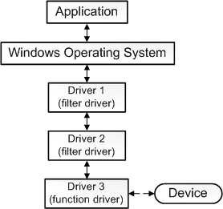

# Empezando a entender los Drivers en Windows 10. (Mayo de 2020)

## Abstract

La idea de este trabajo nace ante la curiosidad de saber cómo funcionan y se crean los drivers en un sistema operativo moderno. Después de hacer prácticas en MS-DOS, un sistema creado hace casi 40 años (1981), se aprecia una evolución más que notable tanto en las características como en la complejidad de algo tan primordial como es crear un driver para un dispositivo de entrada-salida (en adelante I/O).

Por tanto, este trabajo debe tomarse como una guía para entender cómo se estructura un driver en Windows 10 y cuáles serían los primeros pasos para crear uno.

# Qué es un driver para Microsoft

La primera duda que se nos plantea es qué es un driver para Microsoft, ya que al empezar a leer la documentación empiezan a explicar muchas cosas y algunas son llamativas y difieren de la idea mental que tenemos de driver y a la que estamos acostumbrados.

Enlace a [What is a driver - Microsoft Docs.](https://docs.microsoft.com/en-us/windows-hardware/drivers/gettingstarted/what-is-a-driver-)

Esto es lógico ya que estamos hablando de un sistema operativo moderno que se basa, como otros, en segregar en capas los distintos componentes.

Nada más empezar a leer la documentación relativa a drivers que ofrece Microsoft nos dicen:

    It is challenging to give a single precise definition for the term driver. In the most fundamental sense, a driver is a software component that lets the operating system and a device communicate with each other. 

Hay que hacer unas matizaciones:

- No todos los drivers son escritos por la empresa que crea el dispositivo.

- No todos los drivers se comunican directamente con un dispositivo (entendido como dispositivo hardware). Por ejemplo, en una llamada de I/O, puede haber varias capas de drivers que interactúan manipulando las peticiones.

    The one driver in the stack that communicates directly with the device is called the function driver; the drivers that perform auxiliary processing are called filter drivers.

- Además, algunos "filter drivers" observan y guardan información sobre peticiones I/O pero no participan activamente. Por ejemplo un "filter driver" que actúa de verificador sobre otros drivers de la pila comprobando que se efectúa correctamente una petición I/O.

Como conclusión tenemos que:

    We could expand our definition of driver by saying that a driver is any software component that observes or participates in the communication between the operating system and a device.

En resumen sería algo como... `"Cualquier parte software que tenga algo que ver con algo que le ocurra a un dispositivo, es considerado driver"`

Parece algo obvio y lógico, pero no nos podemos olvidar de esta definición porque la cosa se puede enrevesar mucho.

## Software Drivers

Aún así, existen drivers software que no tienen nada que ver con un dispositivo y sirven para extraer recursos del Kernel a la capa de Usuario.

En la siguiente imagen se ve cómo una aplicación utiliza un driver software para acceder a recursos del kernel que en modo usuario no podría adquirir.

Aquí existe más información sobre [User mode and kernel mode](https://docs.microsoft.com/en-us/windows-hardware/drivers/gettingstarted/user-mode-and-kernel-mode) relativa a los modos del procesador  a la hora de crear un driver.

## Notas adicionales

Volvemos al "function driver" del que hemos hablado antes. Recordamos que era un driver de la pila que se conecta directamente con un dispositivo. Esto es así si el dispositivo se conecta por el bus PCI, ya que se tiene mapeado el puerto y los recursos de memoria.

En un dispositivo USB, este se conecta con un host bus adapter (llamado a USB host controller) que se conecta a su vez a un bus PCI. Tanto el dispositivo USB como el USB host controller tienen un "function driver", uno cada uno.

Como explican en la documentación:

    The function driver for the toaster communicates indirectly with the toaster by sending a request to the function driver for the USB host controller. 
    The function driver for the USB host controller then communicates directly with the USB host controller hardware, which communicates with the toaster.

## Conclusiones hasta ahora

Hasta ahora hemos visto que:

- Un driver puede ser muchas cosas.

- Hay distintos tipos según su función.

- Si nos conectamos por un controlador que nos conecta a un dispositivo (un dispositivo USB por ejemplo), la cosa ya se complica porque necesitamos dos drivers de tipo "function drivers" más los drivers que hagan falta para controlar el dispositivo.

Como vemos, en comparación con las prácticas que hemos hecho en MS-Dos en las que accedíamos directamente por llamadas al sistema a los dispositivos, aquí hay que desarrollar varios software antes de poder hacer nada con un dispositivo.

## Driver Model: qué tipo de driver quiero hacer y qué parte de código me da Microsoft.

Los tipos de driver que hay en Windows son, aparte de lo visto anteriormente, estos:

- Device function driver
- Device filter driver
- Software driver
- File system filter driver
- File system driver

Para los "Device function driver", Microsoft aporta gran parte del código general para algunas tecnologías (las más comunes están incluidas). A estos drivers  de dispositivo que s nos dan casi completos se les llama "minidriver".

    Some of the individual technologies have minidriver models. In a minidriver model, the device driver consists of two parts: one that handles general tasks, and one that handles device-specific tasks. Typically, Microsoft writes the general portion and the device manufacturer writes the device-specific portion.

Algunos de los *minidrivers* se muestran a continuación. Vemos que se incluyen los que se corresponden con los dispositivos más habituales:

- Display miniport driver
- Audio miniport driver
- Battery miniclass driver
- Bluetooth protocol driver
- HID minidriver
- WIA minidriver
- NDIS miniport driver
- Storage miniport driver
- Streaming minidriver

Microsoft nos advierte:

    The documentation for a particular technology might advise you to use the Kernel-Mode Driver Framework (KMDF); the documentation for another technology might advise you to use the User-Mode Driver Framework (UMDF). The key point is that you should start by studying the documentation for your specific device technology. 

Además de que...
     If your device technology has a minidriver model, you must use the minidriver model. Otherwise follow the advice in the your technology-specific documentation about whether to use the UMDF, KMDF, or the Windows Driver Model (WDM).

Sí, aparte de tres palabras nuevas (UMDF, KMDF y WDM), hay que estudiar más documentación. Y es que si todavía no nos habíamos dado cuenta, no hay un *Manual rápido de creación de drivers* porque no puede haberlo. Sencillamente, es difícil, ya que según el dispositivo que estemos tratando vamos a necesitar varias partes software. Vamos a ver un ejemplo en la próxima sección.

## Driver para un ratón USB. Qué haría falta.

Componentes que necesitaríamos para hacer desde cero un driver para un ratón conectado por USB a Windows 10:

- *Function driver* para el dispositivo USB como tal.
- *Function driver* para el *USB host controller* al que está conectado el ratón.

Escoger una de las siguientes:

- Driver basado en UMDF + driver basado en KMDF. Opción sencilla y más segura ya que hay separación de capas.
- Driver basado en KMDF. Nos quitamos la parte de driver a nivel de usuario y aumentamos en complejidad, ya que no disponemos de ciertas funciones más "globales".
- Driver basado en WDM. No recomendado ni por Microsoft ([*In the extremely rare case that your driver needs access to data structures not available through KMDF, use WDM as your driver model*](https://docs.microsoft.com/en-us/windows-hardware/drivers/gettingstarted/choosing-a-driver-model#choosing-a-driver-model-for-a-device-filter-driver)). Usamos llamadas al Kernel que nosotros mismos tenemos que gestionar.

Recordemos que en la práctica 2, acceder a cualquier dispositivo en MS-DOS era tan simple como *realizar interrupciones software a través de la función no estándar int86(), que viene definida en el fichero dos.h de varios compiladores de C*.

# Prueba de concepto: Interactuar en Windows 10 con un ratón USB.

Windows proporciona en su GitHub proyectos de ejemplo relativos a drivers. He escogido uno que se llama *firefly* que interactúa con el ratón encendiendo y apagando la luz. Es un KMDF filter driver para un dispositivo HID (dispositivo de interfaz humana).

Documentación e instrucciones:

https://github.com/microsoft/Windows-driver-samples/tree/master/hid/firefly

## Instalación

Primero tenemos q tener Windows 10. He usado una maquina virtual que proporciona Windows de prueba con bastantes recursos para informáticos ya instalados.

https://developer.microsoft.com/es-es/windows/downloads/virtual-machines

Hay que instalar el WDK (Windows Driver Kit que no viene por defecto). No olvidar instalar al final la extension que conecta el WDK con Visual Studio.

Un tutorial de instalación paso a paso que me ha servido es este:

[Windows Kernel Programming Tutorial 3 - Writing a simple driver - Youtube](https://youtu.be/Nc-uh8O989I)

Cuando abrimos Visual Studio con el proyecto, vemos esta estructura relativa al driver como tal:

Al intentar compilar el proyecto saltaba un error relativo a unas bibliotecas Spectre que no estaban en el sistema. Investigando descubrí que era una parte que había que instalar y que nadie nunca me dijo en ningún tutorial. Son las *Spectre-mitigated libs* correspondientes a tu versión concreta del kit de desarrollo y a la plataforma objetivo que tengas.

Una vez todo instalado siguiendo el tutorial de Firefly, al conectar nuestro ratón vemos que ha cambiado de nombre. 

Antes de introducir el ratón:

Después:

Como dato importante, debo decir que la máquina virtual con todo instalado para que funcione y compile el proyecto, ocupa **48 GB**.

## Pruebas realizadas

Una vez todo instalado, probé a ejecutar el programa *Flicker* bajo línea de comandos (es el programa de usuario que se comunica con el driver para encender o apagar el ratón) y no funcionó. 
Creo que es problema de las direcciones de mapeo del ratón, que está configurado para funcionar con un ratón específico de Microsoft que yo no tengo.

Tampoco he podido realizar ninguna salida de prueba tipo *Hello World!* porque para eso se necesitaría otra máquina sobre la que instalar el driver (no valdría usar la propia) y conectarlas por red, ya que aparte de la dificultad de dedicarle más trabajo necesitaba más espacio en disco para otra máquina virtual.

Sí se ha conseguido al final compilar y cargar un driver en el sistema y hacer que funcione el ratón con código que hemos compilado y verificado nosotros.

# Ideas de mejora o de trabajos para futuros estudiantes

Entre las ideas de proyectos futuros estarían:

- Actualizar toda la parte teórica con el estado de arte que tenga lugar en ese futuro relativa a drivers en Windows.

- Echar a andar el programa *Flicker*, mapeando correctamente el ratón que se vaya a utilizar.

- Hacer un *Hola Mundo!* con mensajes de debugging en dos máquinas conectadas.

# Conclusiones

Como conclusiones de este trabajo podemos ver las siguientes:

- Aunque algo parezca sencillo en un tutorial, a ti siempre te va a fallar algo.

- Hacer un driver a estas alturas de la vida, en un sistema operativo moderno, requiere de mucha dedicación y estudio.

- Una arquitectura de capas abstrae de ciertas complicaciones hardware pero a cambio hace más complejo entender todo lo que le rodea.

- Ahora conozco los fundamentos de drivers en Windows y qué tendría que mirar más en profundidad para hacer un driver en concreto.

- La curiosidad es buena y he aprendido bastante, pero ya se ve justificado el porqué a modo de ejemplo en clase se usa MS-DOS y no otro sistema operativo.

# Documentación y recursos:

**Página principal de Microsoft sobre drivers para Windows**: https://docs.microsoft.com/en-us/windows-hardware/drivers/

¿Qué es un driver?: 
https://docs.microsoft.com/en-us/windows-hardware/drivers/gettingstarted/what-is-a-driver-

Máquinas virtuales: 
https://developer.microsoft.com/es-es/windows/downloads/virtual-machines

Writing a simple driver - Youtube:

https://youtu.be/Nc-uh8O989I

Documentación sobre HID USB de Microsoft:

https://docs.microsoft.com/en-us/windows-hardware/drivers/hid/

https://docs.microsoft.com/en-us/windows-hardware/drivers/hid/keyboard-and-mouse-hid-client-drivers

Proyecto de Firefly:
https://github.com/microsoft/Windows-driver-samples/tree/master/hid/firefly

Documentación antigua sobre HID minidrivers:
https://docs.microsoft.com/es-es/previous-versions/ff540774(v=vs.85)

